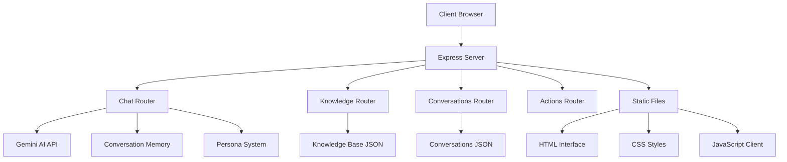

# 🌸 Hind Smart Agent System - Complete Documentation

## Table of Contents
1. [System Overview](#system-overview)
2. [Architecture & Components](#architecture--components)
3. [Features & Capabilities](#features--capabilities)
4. [Technical Implementation](#technical-implementation)
5. [API Documentation](#api-documentation)
6. [Installation & Setup](#installation--setup)
7. [Usage Guide](#usage-guide)
8. [Configuration](#configuration)
9. [Data Models](#data-models)
10. [AI Integration](#ai-integration)
11. [Memory & Session Management](#memory--session-management)
12. [Security Considerations](#security-considerations)
13. [Troubleshooting](#troubleshooting)
14. [Future Enhancements](#future-enhancements)

---

## System Overview

### What is Hind Smart Agent System?

The **Hind Smart Agent System** is an intelligent conversational AI application specifically designed for the Algerian beauty and health consulting market. It combines Google's Gemini AI with sophisticated persona management, knowledge base integration, and conversation memory to create a natural, expert-level beauty consultant experience.

### Key Characteristics

- 🇩🇿 **Algerian Market Focused**: Bilingual support (Arabic/French) with local pricing in DA
- 💄 **Beauty & Health Expert**: Specialized in cosmetics, skincare, haircare, and wellness
- 🧠 **Conversation Memory**: Maintains context across multiple message exchanges
- 📚 **Knowledge Base**: Dynamic, searchable product and advice database
- 🎭 **Persona System**: Configurable AI personalities with specific behaviors
- 💬 **Natural Communication**: Warm, trustworthy, and culturally adapted interaction style

---

## Architecture & Components

### System Architecture



### Core Components

#### 1. **Server Layer (`server.js`)**
- Express.js application server
- CORS and body parsing middleware
- Static file serving for frontend
- Route management and API endpoint orchestration

#### 2. **Chat System (`routes/chat.js`)**
- AI conversation handling with Gemini integration
- Conversation memory management
- Persona-based response generation
- Language detection and switching (Arabic/French)
- Knowledge base integration for context

#### 3. **Knowledge Management (`routes/knowledge.js`)**
- CRUD operations for knowledge base entries
- Product information storage and retrieval
- Tag-based categorization
- Search and filtering capabilities

#### 4. **Conversation Management (`routes/conversations.js`)**
- Session-based conversation tracking
- Message history persistence
- Conversation analytics and reporting
- Memory cleanup and optimization

#### 5. **Action System (`routes/actions.js`)**
- Dynamic action execution capabilities
- System integration points
- Automated response triggers

#### 6. **Frontend Interface (`public/`)**
- Responsive chat interface (`chat.html`)
- Modern styling (`style.css`)
- Real-time messaging (`script.js`)
- Session management and persistence

#### 7. **Configuration System (`config/`)**
- Persona definitions (`personas.json`)
- Behavior and response patterns
- Language policies and cultural adaptations

#### 8. **Data Layer (`data/`)**
- Knowledge base storage (`knowledge.json`)
- Conversation history (`conversations.json`)
- JSON-based persistence with file system backend

---

## Features & Capabilities

### 🤖 AI-Powered Consultation

**Persona-Based Intelligence**
- Professional beauty consultant persona with years of experience
- Expert knowledge of 10,000+ products and their DA pricing
- Warm, trustworthy communication style adapted to Algerian culture
- Natural conversation flow with memory retention

**Multi-Language Support**
- Automatic language detection (Arabic script vs. Latin script)
- Seamless switching between Darja (Algerian Arabic) and French
- Culturally appropriate responses and terminology
- Natural code-switching behavior common in Algeria

### 💼 Professional Consulting Features

**Product Expertise**
- Comprehensive database of cosmetics, skincare, haircare, and wellness products
- Detailed ingredient analysis and compatibility information
- Price information in Algerian Dinar (DA)
- Usage instructions and application guidance

**Personalized Recommendations**
- Skin type analysis through conversation
- Age-appropriate product suggestions
- Budget-conscious recommendations
- Need-based product matching (2-3 products maximum per recommendation)

**Sales Optimization**
- Natural upselling without pressure
- Complementary product suggestions
- Enthusiastic closing techniques
- Trust-building communication patterns

### 🧠 Advanced Memory System

**Session Management**
- Unique session IDs for conversation continuity
- Cross-session memory persistence
- Automatic session cleanup and optimization
- Memory-aware response generation

**Context Awareness**
- Conversation history integration in AI prompts
- Progressive knowledge building about user preferences
- Reference to previous recommendations and discussions
- Coherent multi-turn conversations

### 📚 Dynamic Knowledge Base

**Content Management**
- CRUD operations for knowledge entries
- Tag-based organization and categorization
- Real-time content updates
- Relevance-based content retrieval

**Search & Retrieval**
- Keyword-based relevance scoring
- Context-aware content matching
- Top-K relevant entry selection
- Integration with AI conversation context

---

## Technical Implementation

### Technology Stack

**Backend**
- **Runtime**: Node.js (>= 18)
- **Framework**: Express.js 4.18.2
- **AI Integration**: Google Generative AI (Gemini) 1.25.0
- **HTTP Client**: Axios 1.4.0
- **Utilities**: UUID 9.0.0, dotenv 16.0.0
- **Development**: Nodemon 2.0.22

**Frontend**
- **Markup**: HTML5 with semantic structure
- **Styling**: CSS3 with modern flexbox/grid layouts
- **Scripting**: Vanilla JavaScript (ES6+)
- **Communication**: Fetch API for REST calls

**Data Layer**
- **Format**: JSON files for persistence
- **Structure**: Relational-like document storage
- **Backup**: File system based with atomic writes

### Code Architecture Patterns

**Modular Routing**
```javascript
// Separation of concerns with dedicated route modules
app.use('/api/knowledge', require('./routes/knowledge'));
app.use('/api/chat', require('./routes/chat'));
app.use('/api/conversations', require('./routes/conversations'));
app.use('/action', require('./routes/actions'));
```

**Persona-Driven AI**
```javascript
// Dynamic persona loading and integration
const personas = readPersonas();
const p = personas['consultant'];
const systemPrompt = buildSystemPrompt(p, language, relevantKnowledge);
```

**Memory-Aware Conversations**
```javascript
// Context building with conversation history
const conversationHistory = getConversationHistory(sessionId);
const contextualPrompt = buildConversationContext(systemPrompt, conversationHistory);
```

---

## API Documentation

### Chat Endpoints

#### `POST /api/chat`
**Purpose**: Process user messages and generate AI responses

**Request Body**:
```json
{
  "message": "string (required) - User message text",
  "persona": "string (optional) - Persona identifier",
  "sessionId": "string (optional) - Session identifier for continuity"
}
```

**Response**:
```json
{
  "response": "string - AI generated response",
  "sessionId": "string - Session identifier",
  "persona": "string - Used persona",
  "language": "string - Detected/used language",
  "relevantKnowledge": "array - Retrieved knowledge entries",
  "conversationLength": "number - Current conversation length"
}
```

### Knowledge Base Endpoints

#### `GET /api/knowledge`
**Purpose**: Retrieve all knowledge base entries

**Response**:
```json
[
  {
    "id": "string - Unique identifier",
    "title": "string - Entry title",
    "content": "string - Entry content",
    "tags": "array - Associated tags",
    "category": "string - Category classification",
    "date": "string - ISO date string"
  }
]
```

#### `POST /api/knowledge`
**Purpose**: Create new knowledge base entry

**Request Body**:
```json
{
  "title": "string - Entry title",
  "content": "string - Entry content",
  "tags": "array - Associated tags",
  "category": "string - Category classification"
}
```

#### `PUT /api/knowledge/:id`
**Purpose**: Update existing knowledge base entry

#### `DELETE /api/knowledge/:id`
**Purpose**: Delete knowledge base entry

### Conversation Endpoints

#### `GET /api/conversations`
**Purpose**: Retrieve conversation history

#### `GET /api/conversations/:sessionId`
**Purpose**: Retrieve specific conversation

#### `DELETE /api/conversations/:sessionId`
**Purpose**: Delete conversation history

### Configuration Endpoints

#### `GET /api/personas`
**Purpose**: Retrieve available personas configuration

---

## Installation & Setup

### Prerequisites

1. **Node.js** (>= 18.0.0)
2. **npm** or **pnpm** package manager
3. **Google AI API Key** (Gemini)

### Installation Steps

1. **Clone/Download the System**
```bash
cd /path/to/hind_smart_agent_system/system/ai\ chat
```

2. **Install Dependencies**
```bash
# Using npm
npm install

# Using pnpm (recommended)
pnpm install
```

3. **Environment Configuration**
```bash
# Create environment file
cp .env.example .env

# Edit .env file
nano .env
```

Required environment variables:
```env
# Google AI Configuration
GEMINI_API_KEY=your_gemini_api_key_here
GEMINI_MODEL=gemini-2.0-flash-exp

# Server Configuration
PORT=3000
NODE_ENV=production
```

4. **Initialize Data Files**
```bash
# Create data directory if it doesn't exist
mkdir -p data

# Initialize empty knowledge base
echo "[]" > data/knowledge.json

# Initialize empty conversations
echo "{}" > data/conversations.json
```

5. **Start the Application**
```bash
# Development mode (auto-reload)
npm run dev

# Production mode
npm start
```

6. **Access the Application**
Open your browser to: `http://localhost:3000`

### Docker Deployment (Optional)

```dockerfile
FROM node:18-alpine
WORKDIR /app
COPY package*.json ./
RUN npm install --production
COPY . .
EXPOSE 3000
CMD ["npm", "start"]
```

---

## Usage Guide

### For End Users

#### Starting a Conversation

1. **Open the Application**: Navigate to `http://localhost:3000`
2. **Language Selection**: Type in either Arabic or French - the system auto-detects
3. **Ask Questions**: Type beauty, health, or wellness related questions
4. **Follow Recommendations**: The consultant will suggest 2-3 products with prices

#### Example Conversations

**Arabic Example**:
```
User: عندي بشرة جافة وعايزة كريم مرطب
Assistant: أهلا بيك حبيبتي 🌸 
للبشرة الجافة نصحك بـ:
1. كريم Vichy Aqualia Thermal - 2800 DA
2. سيروم The Ordinary Hyaluronic Acid - 1200 DA
هاد المنتجين راح يرطبولك البشرة من العمق...
```

**French Example**:
```
User: J'ai des cheveux gras, que me conseillez-vous?
Assistant: Bonjour chère cliente! 💚
Pour les cheveux gras, je vous recommande:
1. Shampooing L'Oréal Elvive Clay - 650 DA  
2. Masque purifiant Garnier Fructis - 480 DA
Ces produits vont réguler l'excès de sébum...
```

#### Session Management

- **New Session**: Click "🔄 Nouvelle conversation" to start fresh
- **Continue Session**: The system remembers your conversation automatically
- **Session Info**: See current session status in the top bar

### For Administrators

#### Knowledge Base Management

1. **Adding Products**:
```bash
curl -X POST http://localhost:3000/api/knowledge \
-H "Content-Type: application/json" \
-d '{
  "title": "Crème Hydratante Nivea",
  "content": "Crème hydratante pour peaux sèches, contient glycérine et panthénol. Prix: 450 DA",
  "tags": ["hydratant", "nivea", "peau-sèche"],
  "category": "soins-visage"
}'
```

2. **Updating Personas**:
Edit `config/personas.json` to modify AI behavior patterns

3. **Monitoring Conversations**:
Check `data/conversations.json` for conversation analytics

---

## Configuration

### Persona Configuration (`config/personas.json`)

The persona system defines the AI's personality, knowledge, and behavior patterns:

```json
{
  "consultant": {
    "role": "certified Algerian health, beauty, and wellbeing consultant...",
    "tone": "friendly, warm, simple, caring, and persuasive...",
    "skills": [
      "expert product knowledge across skincare, haircare, nutrition, and wellness",
      "analyzes client needs through natural conversation",
      "adapts instantly to the user's preferred language (Darja or French)"
    ],
    "behaviors": {
      "greeting": "starts conversations warmly with phrases like 'أهلا بيك 🌸 واش راكي؟'",
      "needs_analysis": "asks soft, personalized questions...",
      "recommendation": "suggests 2–3 products maximum, clearly stating the price in DA"
    },
    "language_policy": {
      "default": "Darja (Algerian Arabic)",
      "secondary": "French",
      "switch_logic": "automatically detect user language based on message characters",
      "currency": "All prices and discussions must use Algerian Dinar (DA)."
    }
  }
}
```

### Memory Configuration

Conversation memory limits (in `routes/chat.js`):
```javascript
const MAX_CONVERSATION_HISTORY = 15; // Keep last 15 exchanges
const CONVERSATION_CLEANUP_THRESHOLD = 20; // Cleanup trigger
```

### AI Model Configuration

Gemini model settings:
```javascript
const model = process.env.GEMINI_MODEL || 'gemini-2.0-flash-exp';
```

---

## Data Models

### Knowledge Entry Schema

```json
{
  "id": "uuid-string",
  "title": "string - Product or advice title",
  "content": "string - Detailed information",
  "tags": ["array", "of", "strings"],
  "category": "string - Classification",
  "date": "ISO-8601-date-string"
}
```

### Conversation Schema

```json
{
  "sessionId": {
    "id": "uuid-string",
    "messages": [
      {
        "id": "uuid-string",
        "role": "user|assistant",
        "content": "string - Message content",
        "timestamp": "ISO-8601-date-string",
        "language": "ar|fr|auto"
      }
    ],
    "metadata": {
      "startTime": "ISO-8601-date-string",
      "lastActivity": "ISO-8601-date-string",
      "messageCount": "number",
      "persona": "string"
    }
  }
}
```

### Persona Schema

```json
{
  "role": "string - Professional role description",
  "tone": "string - Communication style",
  "skills": ["array", "of", "expertise", "areas"],
  "behaviors": {
    "greeting": "string - How to start conversations",
    "needs_analysis": "string - How to understand user needs",
    "recommendation": "string - How to suggest products",
    "closing": "string - How to encourage purchases"
  },
  "language_policy": {
    "default": "string - Primary language",
    "secondary": "string - Secondary language", 
    "switch_logic": "string - Language detection rules",
    "currency": "string - Price display format"
  }
}
```

---

## AI Integration

### Gemini API Integration

The system uses Google's Gemini API for natural language processing:

```javascript
async function callGemini(contextualPrompt, currentMessage) {
  const { GoogleGenAI } = require('@google/genai');
  const apiKey = process.env.GEMINI_API_KEY;
  const ai = new GoogleGenAI({ apiKey });
  const model = process.env.GEMINI_MODEL || 'gemini-2.0-flash-exp';
  
  const fullPrompt = `${contextualPrompt}\nClient: ${currentMessage}\n\nConsultant:`;
  
  const response = await ai.models.generateContent({
    model,
    contents: fullPrompt,
  });
  
  return response.text;
}
```

### Context Building

The system builds rich context for AI responses:

1. **System Prompt**: Based on persona configuration
2. **Knowledge Context**: Relevant product information
3. **Conversation History**: Previous message exchanges
4. **Language Context**: Detected user language preference

### Fallback Mechanisms

- **API Failure Handling**: Graceful degradation to contextual echo mode
- **Rate Limiting**: Built-in request throttling
- **Error Recovery**: Automatic retry with exponential backoff

---

## Memory & Session Management

### Session Lifecycle

1. **Session Creation**: Generate UUID on first message or explicit creation
2. **Message Persistence**: Store all exchanges with timestamps
3. **Context Building**: Include relevant history in AI prompts
4. **Memory Optimization**: Periodic cleanup of old conversations
5. **Session Termination**: Manual or automatic based on inactivity

### Memory Optimization

**Conversation Limits**:
- Keep last 15 message exchanges per session
- Trigger cleanup when exceeding 20 exchanges
- Maintain metadata for analytics while trimming content

**Cleanup Strategy**:
```javascript
function cleanupOldConversations() {
  const conversations = readConversations();
  const now = Date.now();
  const maxAge = 7 * 24 * 60 * 60 * 1000; // 7 days
  
  Object.keys(conversations).forEach(sessionId => {
    const conv = conversations[sessionId];
    if (now - new Date(conv.metadata.lastActivity).getTime() > maxAge) {
      delete conversations[sessionId];
    }
  });
  
  writeConversations(conversations);
}
```

### Context Integration

The conversation history is intelligently integrated into AI prompts:

```javascript
function buildConversationContext(systemPrompt, history, language) {
  let context = systemPrompt;
  
  if (history.length > 0) {
    context += "\n\nConversation History (maintain context and continuity):\n";
    history.slice(-MAX_CONVERSATION_HISTORY).forEach(msg => {
      const role = msg.role === 'user' ? 'Client' : 'Consultant';
      context += `${role}: ${msg.content}\n`;
    });
  }
  
  return context;
}
```

---

## Security Considerations

### API Security

**Environment Variables**:
- Never commit API keys to version control
- Use `.env` files for configuration
- Validate all environment variables on startup

**Input Validation**:
```javascript
if (!message || typeof message !== 'string' || message.trim().length === 0) {
  return res.status(400).json({ error: 'Valid message required' });
}
```

**Rate Limiting** (Recommended):
```javascript
const rateLimit = require('express-rate-limit');
const chatLimiter = rateLimit({
  windowMs: 15 * 60 * 1000, // 15 minutes
  max: 100 // limit each IP to 100 requests per windowMs
});
app.use('/api/chat', chatLimiter);
```

### Data Security

**File Permissions**:
```bash
chmod 600 .env
chmod 644 data/*.json
chmod 755 config/
```

**Data Sanitization**:
- HTML escape all user inputs
- Validate JSON structure before parsing
- Implement request size limits

### CORS Configuration

```javascript
app.use(cors({
  origin: process.env.ALLOWED_ORIGINS?.split(',') || ['http://localhost:3000'],
  credentials: true
}));
```

---

## Troubleshooting

### Common Issues

#### 1. **API Key Issues**
```
Error: GEMINI_API_KEY not set
```
**Solution**: Verify `.env` file contains correct API key
```bash
echo $GEMINI_API_KEY  # Should return your key
```

#### 2. **File Permission Errors**
```
Error: EACCES: permission denied, open 'data/conversations.json'
```
**Solution**: Fix file permissions
```bash
sudo chown -R $USER:$USER data/
chmod 644 data/*.json
```

#### 3. **Port Already in Use**
```
Error: listen EADDRINUSE: address already in use :::3000
```
**Solution**: Use different port or kill existing process
```bash
lsof -ti:3000 | xargs kill
# Or change port in .env
echo "PORT=3001" >> .env
```

#### 4. **Memory Issues with Large Conversations**
**Symptoms**: Slow responses, high memory usage
**Solution**: Reduce conversation history limits
```javascript
const MAX_CONVERSATION_HISTORY = 5; // Reduce from 15
```

### Debug Mode

Enable detailed logging:
```javascript
// Add to server.js
if (process.env.NODE_ENV === 'development') {
  app.use((req, res, next) => {
    console.log(`${new Date().toISOString()} - ${req.method} ${req.path}`);
    next();
  });
}
```

### Health Check Endpoint

Add monitoring endpoint:
```javascript
app.get('/health', (req, res) => {
  res.json({
    status: 'healthy',
    timestamp: new Date().toISOString(),
    uptime: process.uptime(),
    memory: process.memoryUsage()
  });
});
```

---

## Future Enhancements

### Planned Features

#### 1. **Advanced Analytics**
- Conversation sentiment analysis
- Product recommendation effectiveness tracking
- User engagement metrics dashboard
- A/B testing framework for persona variations

#### 2. **Enhanced AI Capabilities**
- Multi-modal support (image analysis for skin conditions)
- Voice interface integration
- Predictive product recommendations
- Seasonal and trend-aware suggestions

#### 3. **Database Integration**
- PostgreSQL/MongoDB migration for better scalability
- Real-time product inventory integration
- Price comparison and alerts
- User preference learning and storage

#### 4. **E-commerce Integration**
- Direct purchase links
- Shopping cart functionality
- Order tracking integration
- Payment gateway integration

#### 5. **Mobile Application**
- React Native mobile app
- Push notifications for new products
- Camera integration for skin analysis
- Offline mode with synchronization

#### 6. **Administrative Dashboard**
- Real-time conversation monitoring
- Knowledge base management interface
- Analytics and reporting tools
- Persona configuration GUI

### Technical Improvements

#### 1. **Performance Optimization**
- Redis caching for frequent queries
- WebSocket implementation for real-time updates
- CDN integration for static assets
- Database connection pooling

#### 2. **Scalability Enhancements**
- Microservices architecture migration
- Load balancing configuration
- Horizontal scaling support
- Auto-scaling based on demand

#### 3. **Security Hardening**
- JWT authentication system
- Role-based access control
- API versioning strategy
- Comprehensive audit logging

#### 4. **DevOps Integration**
- Docker containerization
- CI/CD pipeline setup
- Automated testing suite
- Monitoring and alerting system

---

## Conclusion

The Hind Smart Agent System represents a sophisticated approach to AI-powered customer consultation, specifically tailored for the Algerian beauty and health market. Its combination of advanced natural language processing, cultural adaptation, and conversation memory creates an engaging and effective digital consultant experience.

The system's modular architecture, comprehensive API design, and focus on user experience make it both powerful for end-users and maintainable for developers. With its foundation in modern web technologies and integration with cutting-edge AI capabilities, the system is well-positioned for future growth and enhancement.

Whether you're looking to deploy this system in a production environment, extend its capabilities, or use it as a foundation for similar applications, this documentation provides the comprehensive guide you need to understand, implement, and maintain the Hind Smart Agent System effectively.

---

## Additional Resources

- [Google Gemini AI Documentation](https://ai.google.dev/docs)
- [Express.js Official Guide](https://expressjs.com/en/guide/routing.html)
- [Node.js Best Practices](https://github.com/goldbergyoni/nodebestpractices)
- [REST API Design Guidelines](https://restfulapi.net/)

---

**Last Updated**: November 17, 2025  
**Version**: 2.0  
**Maintainer**: Hind Smart Agent Development Team
